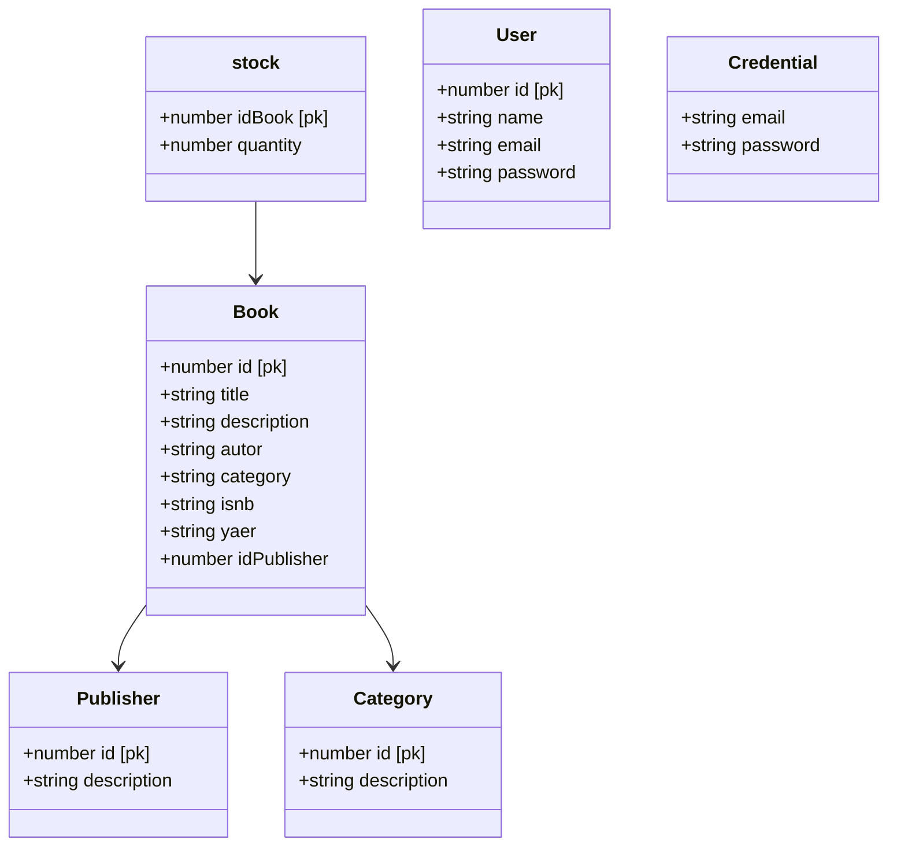

# Diagrama

```mermaid
classDiagram

Book --> Publisher
Book --> Category
stock --> Book

class User {
    +number id [pk]
    +string name
    +string email
    +string password
}

class Credential{
     +string email
    +string password
}


class Book {
    +number id [pk]
    +string title
    +string description
    +string autor
    +string category
    +string isnb
    +string yaer
    +number idPublisher
}


class Publisher {
    +number id [pk]
    +string description
}

class Category {
    +number id [pk]
    +string description
}

class stock {
    +number idBook [pk]
    +number quantity
}


```
