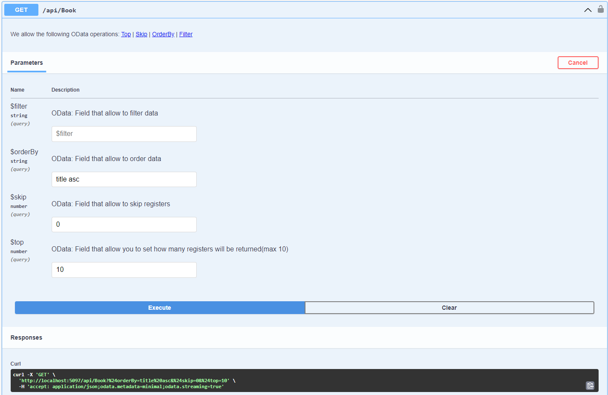

# DoroTech.BookStore Api

Challenge Solution

## Architecture:

 * Clean Architecture
 * Error handler with operation result
 * Logging events by middleware
 * Using OData to paginate, sort and filter data


## Technologies:

    * .NET 8
    * Entity Framework + MSSQL Server
    * Mapster
    * OData
    * OperationResult
    * MediatR
    * Swagger
    * Serilog
    * FluentAssertion and FluentValidations

### Run Services

1. Run docker compose to create/start mssql container

```
$: docker-compose up -d
```

2. Run and Build
```
$: cd .src\DoroTech.BookStore.Api\
$: dotnet run
```

or run by VS or VS Code

>```
> Admin credentials:
>- admin@bookstore.com
>- DoroTech@123
>```

### Swagger

If you use Swagger UI and wants to get all data books, needs to specify **odata parameters** or **clean all of them**.

For example:
#### 1. Query all books ascending by title

Needs to fill field `$orderBy`
 


#### 2. Query all books: Clean all odata fields

The results will have the length default.

#### 3. Paginate books:
Use the fields `$skip` and `$top`

> OBS.: Does not need to write "Bearer" on Swagger field to Authenticate, just paste the token and click "Authorize"
